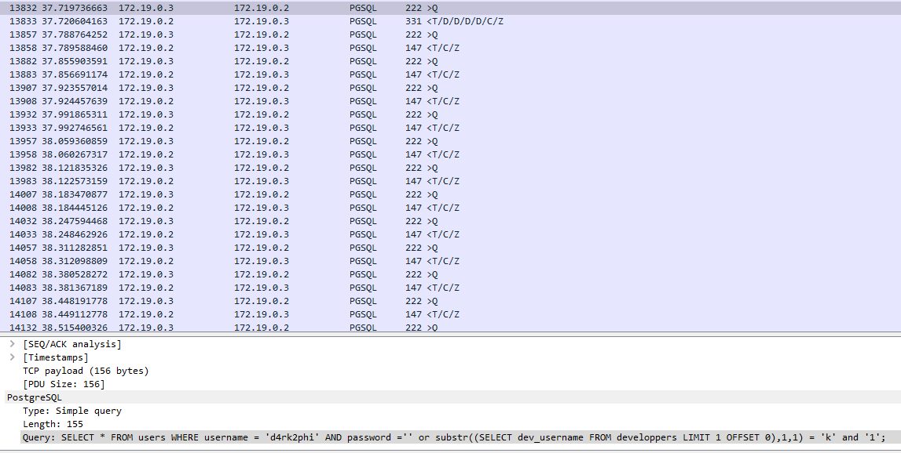

# Pain In The Ass
For this challenge, we are given an PCAP dump to analyse. Typical stuff, right? However, we have look through a dump of `pgsql` sequences to find our flag.
## Initial thoughts
On initial inspection, what stands out are the PGSQL protocol messages being sent and recieved, an indication of an Error-based SQLi attack. What also is interesting is the sequencing, as we are typically seeing a Query `>Q` message being sent, then a Response `<T/C/Z` message being replied as well as a follow-up ready-state message. With over `80000` packets, it'd be impossible to trawl through manually, so lets do some simple filtering.
## Simple Filter
<p align="center">

</p>

Let's first filter simply by `PGSQL` packet, and spend a little time seeing what stands out if anything. Our first indication of something interesting can be seen as packet `13833`, a response that is different to most around it, giving the info `T/D/D/D/D/C/Z`, suggesting that there is data being sent back to the user. On inspection of this packet, we see the data being replied with is:
```
USER-ALPHA: th3_fl4g_1s_n0t_h3r3	
USER-BETA: h3r3_1s_n0t_th3_fl4g
USER-GAMMA: l00k1ng_f0r_34sy_p01nts
USER-DELTA: 3rr0r_b4s3d_1s_s0_34syC
```
Interesting enough, however, assuming this is one of the successful attempts at the attack, let's look at the initial query being sent for this reply:
```
SELECT * FROM users WHERE username = 'd4rk2phi' AND password ='' or substr((SELECT dev_username FROM developpers LIMIT 1 OFFSET 0),1,1) = 'k' and '1';
```
This leads us to believe that dev_username returning the `T/D/D/D/D/C/Z` response, at offset 1 equals to `k`. In other words, the query asking if the first letter of the username is `k` invokes a positive error response. Since we now know the first letter of the username, we can traverse each error response to determine the username and password being responded with:
```
dev_username: k3v1n
dev_password: shkCTF{4lm0st_h1dd3n_3xtr4ct10n_0e18e336adc8236a0452cd570f74542}
```
