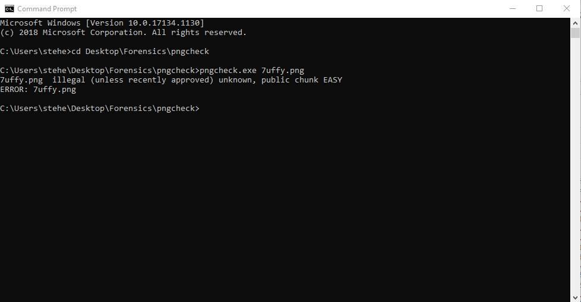
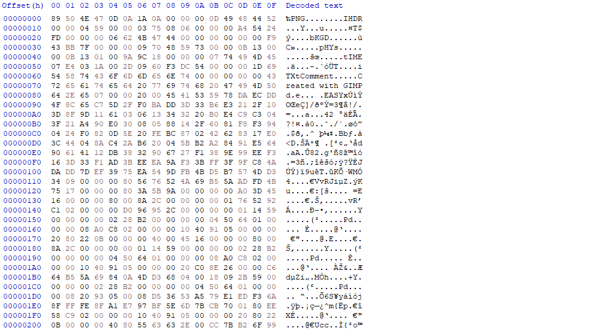

# Romance Dawn
In this challenge we are given an unopenable PNG file to fix! The name of the file being '7uffy.png' that we are able to download.
## First Step
We will call pngcheck to audit the PNG file to tell us anything that can help us in the solving of this challenge. Using the input 
```console
pngcheck.exe 7uffy.png
7uffy.png  illegal (unless recently approved) unknown, public chunk EASY
ERROR: 7uffy.png
```
<p align="center">

</p>

PNG files contain `critical chucks` within the binary, The header `IHDR`, The pallete `PLTE`, `IDAT` and footer `IEND` chunks. We can suspect that the task will want us to fix these chunks, and that the public chunk `EASY` has something to do with it.

## Fixing the image
<p align="center">

</p>

As we can see, after an initial view we can already see an `EASY` chunk located at offset `00000080`. However, we can search for the string on HxD to find three more at offset's `00002090` , `00040A0` and ``00060A0``. So, what should we replace these as?

Well, in PNG files the `PLTE` chunk has to precede what is called the `bKGD` (background) chunk, however from inspection in HxD we can see that no `EASY` precedes the background chunk to fix, and is optional. Therefore, all `EASY` chunks can be replaced with respective `IDAT` chunks via the replacing tool in HxD. We will now save the image as a new file.
## Outcome
We can now attain the flag by opening the image!
<p align="center">

</p>

